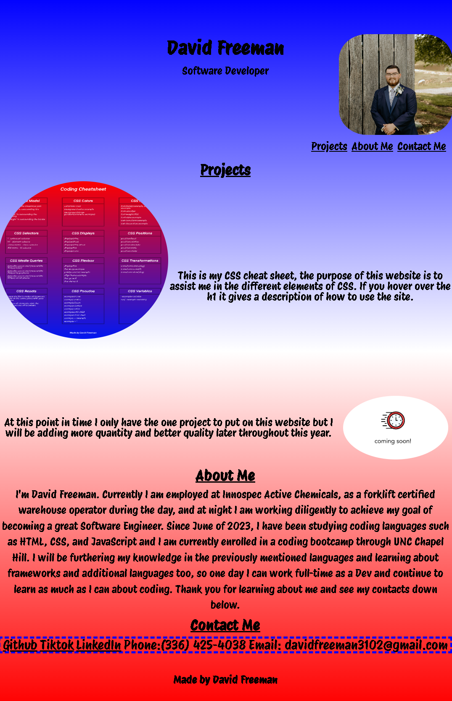

# david-freeman
Second bootcamp challenge, making my first portfolio to display my work as a software developer. My name, recent photo and links are presented to show my work and how to contact me. The links function properly, my first project image is linked to the launched website for viewing, and proper media queries are used to make the page responsive to different viewports.

Here is a screenshot of the finished project.

Here is the link to the deployed project.

https://dfreeman3102.github.io/david-freeman/